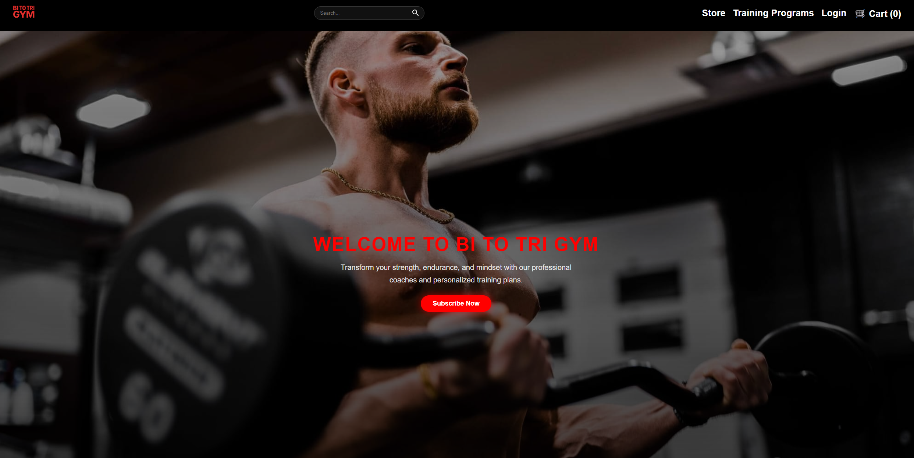
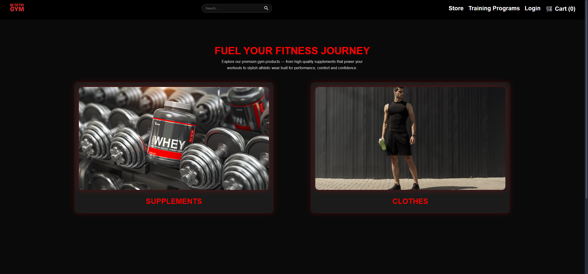
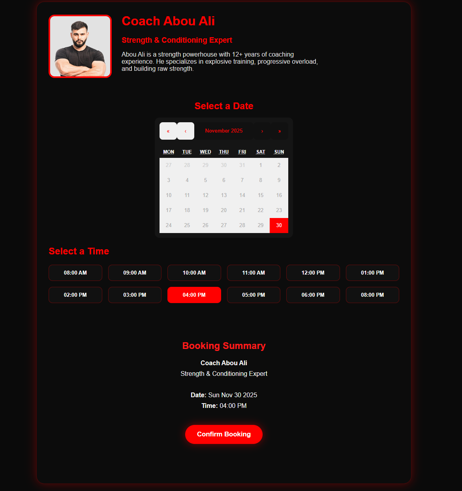
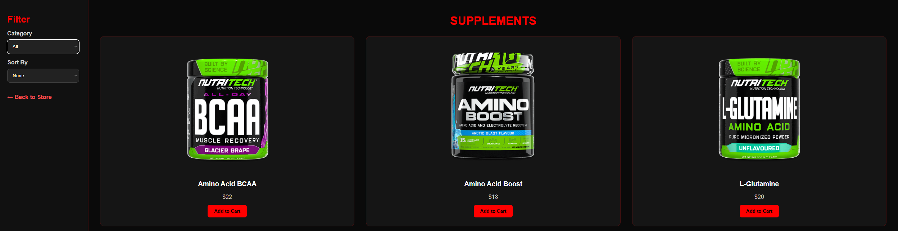

# Bi To Tri Gym — Full Fitness Web Application

A modern, responsive, full-featured gym web application built using **React.js**, offering users a complete fitness experience including **store shopping, training programs, subscription plans, and coach booking**.

---

## 🚀 Features

### ✅ Home Page
- Animated hero section  
- About section  
- Why Choose Us section  
- Testimonial section  
- Store categories  
- Premium fitness UI  

### 🛒 Store
- Supplements page  
- Clothes page  
- Dynamic filters (category, sizes, sorting)  
- Add to Cart system  
- Cart sidebar with quantity controls  
- Checkout page with card-style payment UI  

### 📅 Coach Booking
- Choose a coach  
- Interactive calendar  
- Select time slots  
- Booking confirmation popup  
- Auto-redirect to home after booking  

### 📝 Training Programs
- Multiple structured programs  
- Description previews  
- PDF generation for training plan  

### 💳 Subscription Plans
- Monthly & yearly plans  
- Redirect to checkout  
- Clean & animated pricing cards  

### 🔍 Global Search System
- Search for:  
  - Coaches  
  - Store items  
  - Programs  
  - Pages  
- Autocomplete dropdown  

### 👤 User System (Frontend Simulation)
- Login  
- Signup

---

## 🛠️ Technologies Used

| Technology | Purpose |
|-----------|---------|
| **React.js** | UI framework |
| **React Router** | Page routing |
| **Context API** | Cart & User state |
| **CSS / Custom Animations** | Styling |
| **React-Calendar** | Coach booking calendar |
| **LocalStorage** | Persistent cart + login |

---

## 📦 Project Setup

Follow the steps below to run the project locally.

> npm install react react-dom react-scripts react-router-dom @mui/material @mui/icons-material @emotion/react @emotion/styled styled-components bootstrap react-icons react-calendar jspdf

> npm start

# Project Strucutre
/public
   ├── favicon.ico
   ├── index.html

/src
   ├── assets/
   ├── components/
   ├── context/
   ├── data/
   ├── pages/
   ├── styles/
   ├── App.js
   ├── index.js

# Screenshots:

